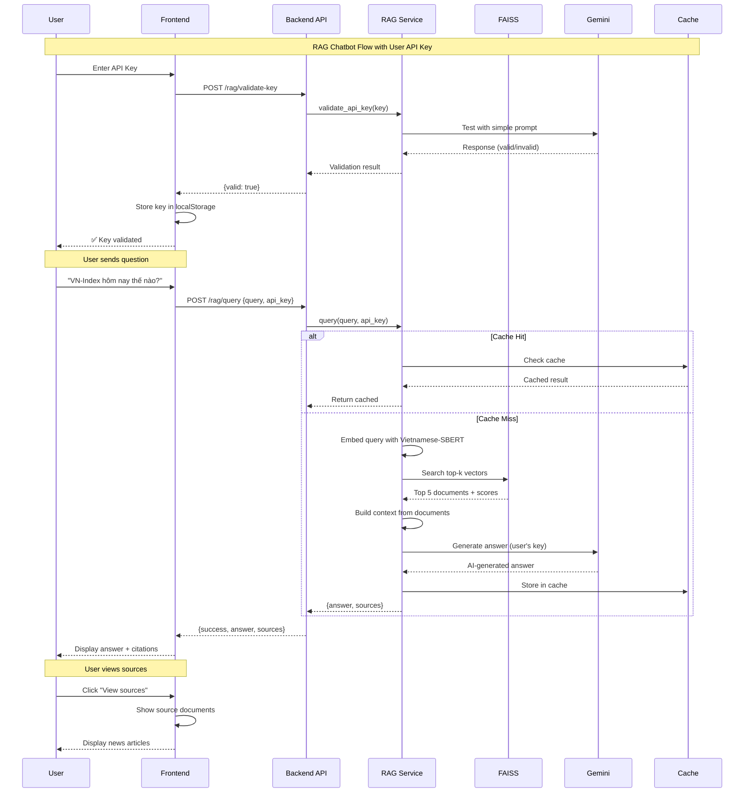
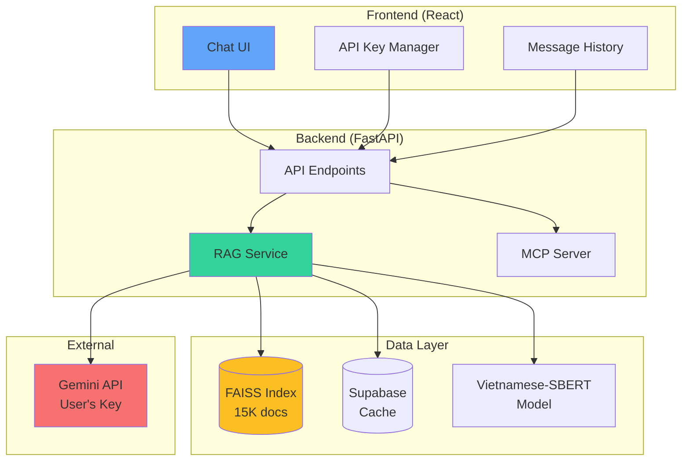
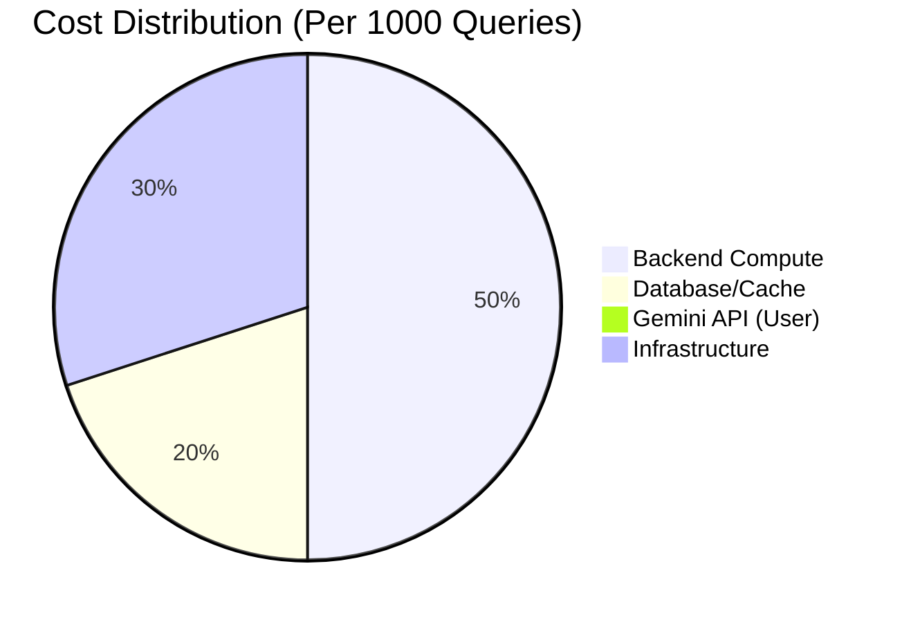
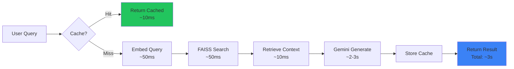
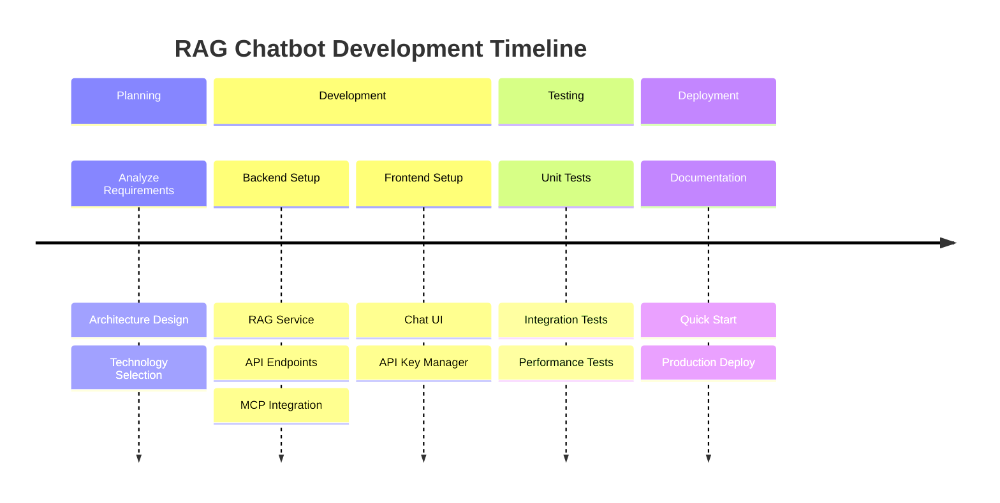

```mermaid
sequenceDiagram
    participant U as User
    participant F as Frontend
    participant B as Backend API
    participant R as RAG Service
    participant V as FAISS
    participant G as Gemini
    participant C as Cache

    Note over U,C: RAG Chatbot Flow with User API Key

    U->>F: Enter API Key
    F->>B: POST /rag/validate-key
    B->>R: validate_api_key(key)
    R->>G: Test with simple prompt
    G-->>R: Response (valid/invalid)
    R-->>B: Validation result
    B-->>F: {valid: true}
    F->>F: Store key in localStorage
    F-->>U: ✅ Key validated

    Note over U,F: User sends question

    U->>F: "VN-Index hôm nay thế nào?"
    F->>B: POST /rag/query {query, api_key}
    B->>R: query(query, api_key)
    
    alt Cache Hit
        R->>C: Check cache
        C-->>R: Cached result
        R-->>B: Return cached
    else Cache Miss
        R->>R: Embed query with Vietnamese-SBERT
        R->>V: Search top-k vectors
        V-->>R: Top 5 documents + scores
        R->>R: Build context from documents
        R->>G: Generate answer (user's key)
        G-->>R: AI-generated answer
        R->>C: Store in cache
        R-->>B: {answer, sources}
    end
    
    B-->>F: {success, answer, sources}
    F-->>U: Display answer + citations

    Note over U,F: User views sources

    U->>F: Click "View sources"
    F->>F: Show source documents
    F-->>U: Display news articles
```

```mermaid
graph TB
    subgraph "Frontend (React)"
        A[Chat UI]
        B[API Key Manager]
        C[Message History]
    end

    subgraph "Backend (FastAPI)"
        D[API Endpoints]
        E[RAG Service]
        F[MCP Server]
    end

    subgraph "Data Layer"
        G[(FAISS Index<br/>15K docs)]
        H[(Supabase<br/>Cache)]
        I[Vietnamese-SBERT<br/>Model]
    end

    subgraph "External"
        J[Gemini API<br/>User's Key]
    end

    A --> D
    B --> D
    C --> D
    D --> E
    D --> F
    E --> G
    E --> H
    E --> I
    E --> J

    style A fill:#60a5fa
    style E fill:#34d399
    style G fill:#fbbf24
    style J fill:#f87171
```

```mermaid
pie title Cost Distribution (Per 1000 Queries)
    "Backend Compute" : 50
    "Database/Cache" : 20
    "Gemini API (User)" : 0
    "Infrastructure" : 30
```

```mermaid
graph LR
    A[User Query] --> B{Cache?}
    B -->|Hit| C[Return Cached<br/>~10ms]
    B -->|Miss| D[Embed Query<br/>~50ms]
    D --> E[FAISS Search<br/>~50ms]
    E --> F[Retrieve Context<br/>~10ms]
    F --> G[Gemini Generate<br/>~2-3s]
    G --> H[Store Cache]
    H --> I[Return Result<br/>Total: ~3s]

    style C fill:#22c55e
    style I fill:#3b82f6
```

```mermaid
timeline
    title RAG Chatbot Development Timeline
    section Planning
        Analyze Requirements : Architecture Design
                             : Technology Selection
    section Development
        Backend Setup : RAG Service
                     : API Endpoints
                     : MCP Integration
        Frontend Setup : Chat UI
                      : API Key Manager
    section Testing
        Unit Tests : Integration Tests
                  : Performance Tests
    section Deployment
        Documentation : Quick Start
                     : Production Deploy
```
