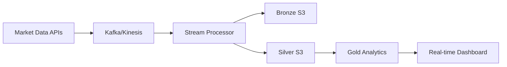
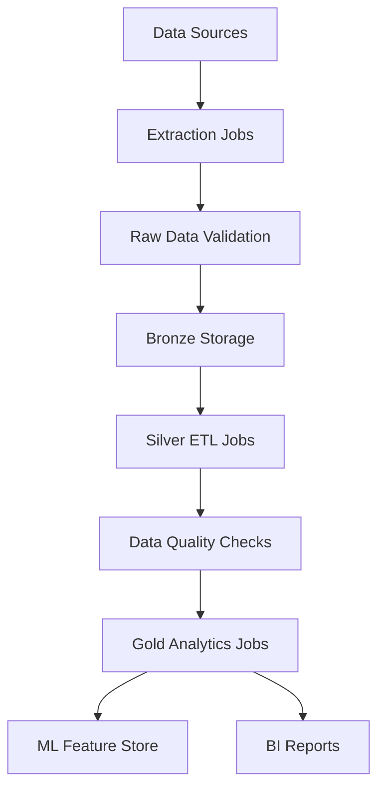
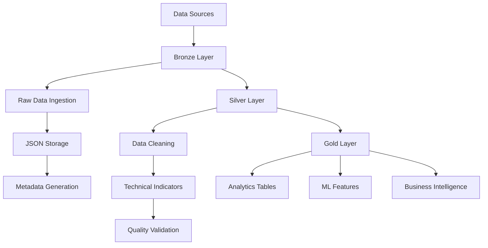

# 🏗️ S3 Data Lakehouse Architecture Documentation

## 📋 Tổng quan hệ thống

Hệ thống Data Lakehouse được thiết kế theo kiến trúc 3 tầng (Bronze → Silver → Gold) trên AWS S3, tối ưu hóa cho việc phân tích tài chính và Machine Learning trong lĩnh vực chứng khoán Việt Nam.

### 🎯 Mục tiêu hệ thống
- **Thu thập và lưu trữ** dữ liệu tài chính theo thời gian thực
- **Xử lý và làm sạch** dữ liệu cho phân tích
- **Cung cấp** dữ liệu sẵn sàng cho Machine Learning và Business Intelligence
- **Hỗ trợ** RAG (Retrieval-Augmented Generation) cho phân tích tin tức tài chính

### 🏛️ Kiến trúc tổng quan

```
📊 Data Sources
    ├── 📈 VNStock (OHLCV data)
    ├── 📰 Financial News
    ├── 📉 Market Indices (VNINDEX, VN30)
    └── 🌏 Macroeconomic Data
          ↓
🥉 BRONZE LAYER (Raw Data Ingestion)
    ├── bronze/stocks/raw/
    ├── bronze/news/raw/
    └── bronze/others/raw/
          ↓
🥈 SILVER LAYER (Cleaned & Processed)
    ├── silver/stocks/processed/
    ├── silver/news/processed/
    └── silver/others/processed/
          ↓
🥇 GOLD LAYER (Analytics & ML Ready)
    ├── gold/analytics/
    ├── gold/serving/
    └── gold/metadata/
```

---

## 🏗️ KIẾN TRÚC HỆ THỐNG VÀ QUY TRÌNH ETL/ELT

### 🎯 Tổng quan kiến trúc Lakehouse

Data Lakehouse kết hợp ưu điểm của Data Lake (tính linh hoạt, chi phí thấp) và Data Warehouse (hiệu suất truy vấn cao, ACID transactions). Hệ thống được thiết kế theo mô hình **Lambda Architecture** với batch processing và real-time processing.

```
┌─────────────────────────────────────────────────────────────────┐
│                    🏗️ LAKEHOUSE ARCHITECTURE                     │
├─────────────────────────────────────────────────────────────────┤
│                                                                 │
│  📊 DATA SOURCES                                                │
│  ├── 📈 VNStock API (Real-time market data)                    │
│  ├── 📰 News APIs (Financial news feeds)                       │
│  ├── 🌐 Web Scraping (Multiple financial websites)             │
│  ├── 📉 Market Indices (VNINDEX, VN30)                         │
│  └── 🌏 External APIs (Macro indicators, FX rates)             │
│                           │                                      │
│                           ▼                                      │
│  🥉 BRONZE LAYER (Raw Data Storage)                             │
│  ├── 📁 S3 Raw Storage                                          │
│  ├── 🔄 Change Data Capture (CDC)                               │
│  ├── 📝 Schema Evolution Support                                │
│  ├── 🗓️ Time-based Partitioning                                │
│  └── 📊 Data Lineage Tracking                                   │
│                           │                                      │
│                           ▼                                      │
│  🥈 SILVER LAYER (Cleaned & Curated)                            │
│  ├── 🧹 Data Quality & Validation                               │
│  ├── 📊 Technical Indicators                                    │
│  ├── 🔄 Slowly Changing Dimensions (SCD)                        │
│  ├── 📈 Incremental Processing                                  │
│  └── 🎯 Business Rule Application                               │
│                           │                                      │
│                           ▼                                      │
│  🥇 GOLD LAYER (Analytics & ML Ready)                           │
│  ├── 📊 Aggregated Tables                                       │
│  ├── 🤖 ML Feature Store                                        │
│  ├── 📈 Business Intelligence Views                             │
│  ├── 🔍 Search & Analytics Engine                               │
│  └── 📊 Real-time Dashboards                                    │
│                                                                 │
└─────────────────────────────────────────────────────────────────┘
```

### 🔄 ETL vs ELT Strategy

Hệ thống sử dụng **hybrid approach** kết hợp cả ETL và ELT:

#### 📥 **ELT (Extract, Load, Transform)** - Primary Pattern
```
Extract → Load to Bronze → Transform in Silver/Gold
```

**Ưu điểm**:
- Lưu trữ raw data hoàn chỉnh
- Flexibility cho future transformations
- Parallel processing capabilities
- Schema-on-read approach

**Use cases**:
- Historical data ingestion
- Batch processing workflows
- Complex analytics transformations

#### 🔄 **ETL (Extract, Transform, Load)** - Secondary Pattern
```
Extract → Transform → Load to Silver/Gold
```

**Ưu điểm**:
- Real-time processing
- Data validation before storage
- Reduced storage costs
- Immediate data availability

**Use cases**:
- Real-time market data
- Critical business metrics
- Data quality enforcement

### 🏛️ Detailed System Architecture

#### 🔧 **Core Components**

1. **Data Ingestion Layer**
```python
┌─────────────────────────────────────────┐
│           🔄 INGESTION LAYER            │
├─────────────────────────────────────────┤
│ • Apache Kafka (Real-time streaming)   │
│ • AWS Kinesis (Event streaming)        │
│ • Scheduled Jobs (Batch processing)    │
│ • Webhooks (Event-driven updates)      │
│ • API Gateways (External integrations) │
└─────────────────────────────────────────┘
```

2. **Processing Engine**
```python
┌─────────────────────────────────────────┐
│          ⚙️ PROCESSING ENGINE           │
├─────────────────────────────────────────┤
│ • Apache Spark (Distributed computing) │
│ • Pandas (Data manipulation)           │
│ • Dask (Parallel computing)            │
│ • Ray (ML workloads)                   │
│ • Custom Python ETL scripts            │
└─────────────────────────────────────────┘
```

3. **Storage Layer**
```python
┌─────────────────────────────────────────┐
│           💾 STORAGE LAYER              │
├─────────────────────────────────────────┤
│ • AWS S3 (Object storage)              │
│ • Delta Lake (ACID transactions)       │
│ • Parquet (Columnar format)            │
│ • JSON (Semi-structured data)          │
│ • Time-series databases                │
└─────────────────────────────────────────┘
```

4. **Orchestration & Monitoring**
```python
┌─────────────────────────────────────────┐
│        🎭 ORCHESTRATION LAYER           │
├─────────────────────────────────────────┤
│ • Apache Airflow (Workflow management) │
│ • Kaggle Notebooks (Development)       │
│ • AWS Lambda (Serverless functions)    │
│ • CloudWatch (Monitoring & alerting)   │
│ • Data Quality monitoring              │
└─────────────────────────────────────────┘
```

### 📊 Data Flow Architecture

#### 🌊 **Stream Processing (Real-time)**


#### 📦 **Batch Processing (Scheduled)**


### 🔄 ETL/ELT Process Details

#### 🥉 **Bronze Layer Processing (ELT Pattern)**

```python
# Bronze ELT Pipeline
def bronze_elt_pipeline():
    """
    ELT Pattern: Extract → Load → Transform minimally
    Goal: Preserve raw data with minimal processing
    """
    
    # 1. EXTRACT
    raw_data = extract_from_sources([
        'vnstock_api',
        'news_feeds', 
        'macro_indicators'
    ])
    
    # 2. LOAD (Minimal transformation)
    for dataset in raw_data:
        # Basic validation only
        validated_data = basic_validation(dataset)
        
        # Load to Bronze with partitioning
        load_to_s3(
            data=validated_data,
            bucket='bronze',
            partition_by=['source', 'date'],
            format='json'  # Preserve original structure
        )
    
    # 3. METADATA GENERATION
    generate_lineage_metadata(raw_data)
    create_data_catalog_entries(raw_data)
```

#### 🥈 **Silver Layer Processing (ETL Pattern)**

```python
# Silver ETL Pipeline
def silver_etl_pipeline():
    """
    ETL Pattern: Extract → Transform → Load
    Goal: Clean, standardize, and enrich data
    """
    
    # 1. EXTRACT from Bronze
    bronze_data = read_from_bronze_layer()
    
    # 2. TRANSFORM (Heavy processing)
    for dataset in bronze_data:
        
        # Data Quality & Cleaning
        clean_data = data_quality_pipeline(dataset)
        
        # Business Rule Application
        enriched_data = apply_business_rules(clean_data)
        
        # Technical Indicators Calculation
        if dataset.type == 'stocks':
            enriched_data = calculate_technical_indicators(enriched_data)
        
        # Schema Standardization
        standardized_data = apply_standard_schema(enriched_data)
        
        # 3. LOAD to Silver
        load_to_s3(
            data=standardized_data,
            bucket='silver',
            partition_by=['data_type', 'year', 'month'],
            format='parquet'  # Optimized for analytics
        )
```

#### 🥇 **Gold Layer Processing (Hybrid ETL/ELT)**

```python
# Gold Hybrid Pipeline
def gold_hybrid_pipeline():
    """
    Hybrid Pattern: ETL for aggregations, ELT for feature engineering
    Goal: Create analytics-ready and ML-ready datasets
    """
    
    # ETL for Business Intelligence
    silver_data = read_from_silver_layer()
    
    # Pre-aggregated tables (ETL)
    market_summary = create_market_summary(silver_data)
    load_to_gold(market_summary, 'analytics/market_summary')
    
    # ELT for Machine Learning
    # Load all silver data to Gold for flexible ML feature engineering
    load_to_gold(silver_data, 'serving/raw_features')
    
    # Transform in Gold layer for different ML use cases
    ml_features = engineer_ml_features(silver_data)
    load_to_gold(ml_features, 'serving/ml_features')
```

### 🎯 Processing Patterns

#### 🔄 **Incremental Processing**

```python
def incremental_processing_pattern():
    """
    Efficient processing of only new/changed data
    """
    
    # 1. Watermark-based processing
    last_processed_timestamp = get_last_watermark()
    new_data = extract_data_since(last_processed_timestamp)
    
    # 2. Change Data Capture (CDC)
    changed_records = identify_changed_records()
    
    # 3. Merge strategy
    existing_data = read_existing_data()
    merged_data = merge_with_upsert(existing_data, new_data)
    
    # 4. Update watermark
    update_watermark(current_timestamp)
```

#### 🔀 **Slowly Changing Dimensions (SCD)**

```python
def scd_type2_implementation():
    """
    Track historical changes in dimension data
    """
    
    # SCD Type 2: Keep full history
    def apply_scd_type2(new_record, existing_records):
        current_record = find_current_record(existing_records)
        
        if record_changed(new_record, current_record):
            # Close current record
            current_record.end_date = today()
            current_record.is_current = False
            
            # Create new record
            new_record.start_date = today()
            new_record.end_date = None
            new_record.is_current = True
            
            return [current_record, new_record]
        
        return [current_record]
```

### 🛡️ Data Quality Framework

#### 📊 **Quality Dimensions**

```python
class DataQualityFramework:
    """
    Comprehensive data quality monitoring
    """
    
    def __init__(self):
        self.quality_dimensions = {
            'completeness': self.check_completeness,
            'accuracy': self.check_accuracy,
            'consistency': self.check_consistency,
            'validity': self.check_validity,
            'timeliness': self.check_timeliness,
            'uniqueness': self.check_uniqueness
        }
    
    def check_completeness(self, df):
        """Missing value analysis"""
        missing_pct = df.isnull().sum() / len(df) * 100
        return {
            'score': 100 - missing_pct.max(),
            'details': missing_pct.to_dict()
        }
    
    def check_accuracy(self, df):
        """Business rule validation"""
        accuracy_rules = [
            lambda x: x['close'] > 0,  # Positive prices
            lambda x: x['volume'] >= 0,  # Non-negative volume
            lambda x: x['high'] >= x['low']  # High >= Low
        ]
        
        violations = 0
        for rule in accuracy_rules:
            violations += (~df.apply(rule, axis=1)).sum()
        
        accuracy_score = (1 - violations / len(df)) * 100
        return {'score': accuracy_score, 'violations': violations}
```

#### 🚨 **Quality Monitoring & Alerting**

```python
def data_quality_monitoring():
    """
    Automated quality monitoring with alerts
    """
    
    quality_thresholds = {
        'completeness': 95.0,
        'accuracy': 98.0,
        'timeliness': 99.0
    }
    
    for dataset in get_all_datasets():
        quality_scores = calculate_quality_scores(dataset)
        
        for dimension, score in quality_scores.items():
            if score < quality_thresholds[dimension]:
                send_alert(
                    severity='HIGH',
                    message=f"Quality issue in {dataset}: {dimension} = {score}%",
                    dataset=dataset,
                    dimension=dimension,
                    score=score
                )
```

### 🔧 Performance Optimization

#### ⚡ **Compute Optimization**

```python
# Parallel Processing Strategy
def optimize_compute():
    """
    Multi-level parallelization for performance
    """
    
    # 1. Data-level parallelism
    partitioned_data = partition_by_symbol(stock_data)
    
    # 2. Process-level parallelism
    with ProcessPoolExecutor(max_workers=8) as executor:
        futures = [
            executor.submit(process_symbol_data, partition)
            for partition in partitioned_data
        ]
        results = [future.result() for future in futures]
    
    # 3. I/O optimization
    # Batch S3 operations
    batch_upload_to_s3(results, batch_size=100)
```

#### 💾 **Storage Optimization**

```python
def optimize_storage():
    """
    Storage format and partitioning optimization
    """
    
    # 1. File format selection
    storage_formats = {
        'bronze': 'json',      # Flexibility
        'silver': 'parquet',   # Analytics performance  
        'gold': 'delta'        # ACID + time travel
    }
    
    # 2. Partitioning strategy
    partitioning_schemes = {
        'stocks': ['symbol', 'year', 'month'],
        'news': ['source', 'year', 'month', 'day'],
        'macro': ['indicator_type', 'year']
    }
    
    # 3. Compression
    compression_settings = {
        'parquet': 'snappy',   # Good compression + speed
        'json': 'gzip',        # High compression ratio
        'delta': 'zstd'        # Best overall compression
    }
```

### 📈 Scalability Architecture

#### 🔄 **Horizontal Scaling**

```python
def horizontal_scaling_strategy():
    """
    Scale-out architecture for growing data volumes
    """
    
    # 1. Distributed processing
    spark_config = {
        'spark.sql.adaptive.enabled': 'true',
        'spark.sql.adaptive.coalescePartitions.enabled': 'true',
        'spark.serializer': 'org.apache.spark.serializer.KryoSerializer',
        'spark.sql.execution.arrow.pyspark.enabled': 'true'
    }
    
    # 2. Auto-scaling compute
    cluster_config = {
        'min_workers': 2,
        'max_workers': 20,
        'target_workers': 5,
        'auto_scaling_policy': 'workload_based'
    }
    
    # 3. Storage tiering
    storage_tiers = {
        'hot': 'S3 Standard',           # Recent data
        'warm': 'S3 Standard-IA',       # 30-90 days
        'cold': 'S3 Glacier',           # 90+ days
        'archive': 'S3 Deep Archive'    # 1+ years
    }
```

### 🔐 Security & Governance

#### 🛡️ **Data Security Framework**

```python
def security_framework():
    """
    Multi-layer security implementation
    """
    
    # 1. Access Control
    access_policies = {
        'bronze': ['data_engineers', 'admin'],
        'silver': ['analysts', 'data_scientists', 'data_engineers'],
        'gold': ['all_users']
    }
    
    # 2. Encryption
    encryption_config = {
        'at_rest': 'AES-256',
        'in_transit': 'TLS 1.3',
        'key_management': 'AWS KMS'
    }
    
    # 3. Audit Logging
    audit_events = [
        'data_access',
        'schema_changes', 
        'quality_failures',
        'pipeline_executions'
    ]
```

#### 📋 **Data Governance**

```python
def data_governance_framework():
    """
    Comprehensive data governance implementation
    """
    
    # 1. Data Catalog
    catalog_metadata = {
        'business_glossary': 'Domain definitions',
        'data_lineage': 'End-to-end tracking',
        'impact_analysis': 'Change impact assessment',
        'usage_analytics': 'Data consumption patterns'
    }
    
    # 2. Privacy & Compliance
    privacy_controls = {
        'pii_detection': 'Automated scanning',
        'data_masking': 'Dynamic masking',
        'retention_policies': 'Automated lifecycle',
        'consent_management': 'User preferences'
    }
```

---

## 🥉 BRONZE LAYER - Raw Data Ingestion

### 📈 Stocks Data (`bronze_stocks.py`)

**Mục đích**: Thu thập dữ liệu OHLCV của cổ phiếu Việt Nam từ VNStock API

#### 🔧 Cấu hình chính
```python
S3_BASE_PATH = 'bronze/stocks'
S3_RAW_PATH = 'bronze/stocks/raw'
S3_METADATA_PATH = 'bronze/stocks/metadata'
S3_INDEX_PATH = 'bronze/stocks/raw/index'
```

#### 📊 Cấu trúc dữ liệu
```
bronze/stocks/
├── raw/
│   ├── {ticker}/
│   │   ├── {ticker}_2024-01-01.json
│   │   ├── {ticker}_2024-01-02.json
│   │   └── ...
│   └── index/
│       ├── VNINDEX.csv
│       └── VN30.csv
└── metadata/
    ├── {ticker}_metadata.json
    └── summary_metadata.json
```

#### 🎯 Tính năng chính
- **Rate Limiting**: Xử lý 2-3 requests/giây để tránh bị chặn
- **Retry Mechanism**: Exponential backoff với 3 lần thử lại
- **Daily JSON Files**: Mỗi ngày giao dịch lưu thành 1 file JSON riêng
- **Metadata Tracking**: Theo dõi quality, completeness và statistics

#### 📋 Schema dữ liệu JSON
```json
{
  "ticker": "VCB",
  "date": "2024-01-01",
  "open": 85000,
  "high": 86000,
  "low": 84500,
  "close": 85500,
  "volume": 1250000,
  "_source": "vnstock_v3",
  "_ingest_time_utc": "2024-01-01T10:00:00Z"
}
```

### 📰 News Data (`bronze_news.py`)

**Mục đích**: Thu thập tin tức tài chính từ nhiều nguồn khác nhau

#### 📊 Cấu trúc dữ liệu
```
bronze/news/
├── raw/
│   ├── {id}.json          # Individual news articles
│   └── daily_news.csv     # Daily aggregated news
└── metadata/
    ├── news_metadata.json
    └── sources_info.json
```

#### 🎯 Tính năng chính
- **Multi-source Collection**: Cafef, VnExpress, Đầu tư
- **Content Extraction**: Title, content, publish_date, source
- **Deduplication**: Loại bỏ tin tức trùng lặp
- **Language Processing**: Hỗ trợ tiếng Việt

#### 📋 Schema dữ liệu JSON
```json
{
  "id": "news_20241001_001",
  "title": "VCB báo lãi quý 3 tăng 15%",
  "content": "Ngân hàng TMCP Ngoại thương Việt Nam...",
  "publish_date": "2024-10-01T08:00:00Z",
  "source": "cafef.vn",
  "category": "banking",
  "url": "https://...",
  "_ingest_time_utc": "2024-10-01T10:00:00Z"
}
```

### 📊 Others Data (`bronze_others.py`)

**Mục đích**: Thu thập dữ liệu vĩ mô và báo cáo tài chính

#### 📊 Cấu trúc dữ liệu
```
bronze/others/
├── raw/
│   ├── macro_gdp.csv
│   ├── macro_cpi.csv
│   ├── macro_interest.csv
│   ├── fx_usdvnd.csv
│   ├── vnindex.csv
│   ├── vn30.csv
│   └── financial_reports/
│       ├── {company}_quarterly.csv
│       └── {company}_annual.csv
└── metadata/
    ├── macro_metadata.json
    ├── fx_metadata.json
    └── financial_metadata.json
```

#### 🎯 Các loại dữ liệu
1. **Macroeconomic Data**:
   - GDP growth rate
   - CPI (Consumer Price Index)
   - Interest rates
   - USD/VND exchange rate

2. **Market Indices**:
   - VNINDEX daily data
   - VN30 index data

3. **Financial Reports**:
   - Quarterly earnings
   - Annual reports
   - Balance sheets

---

## 🥈 SILVER LAYER - Cleaned & Processed Data

### 🔄 Transformation Process (`silver_stocks_complete.py`)

**Mục đích**: Làm sạch, validate và tính toán technical indicators

#### 🧹 Data Cleaning Process

1. **Deduplication**: Loại bỏ records trùng lặp
2. **Data Type Validation**: Đảm bảo đúng kiểu dữ liệu
3. **Missing Value Handling**: Xử lý giá trị thiếu
4. **Outlier Detection**: Phát hiện và xử lý outliers
5. **Date Standardization**: Chuẩn hóa format ngày tháng

#### 📊 Technical Indicators

```python
def calculate_technical_indicators(df):
    # Moving Averages
    df['ma_5'] = df['close'].rolling(5).mean()
    df['ma_20'] = df['close'].rolling(20).mean()
    df['ma_50'] = df['close'].rolling(50).mean()
    
    # RSI (Relative Strength Index)
    df['rsi_14'] = calculate_rsi(df['close'], 14)
    
    # MACD
    df['macd'], df['macd_signal'] = calculate_macd(df['close'])
    
    # Bollinger Bands
    df['bb_upper'], df['bb_lower'] = calculate_bollinger_bands(df['close'])
    
    # Volatility
    df['volatility_20d'] = df['daily_return'].rolling(20).std()
    
    # Volume indicators
    df['volume_ma_20'] = df['volume'].rolling(20).mean()
    df['volume_ratio'] = df['volume'] / df['volume_ma_20']
```

#### 📊 Cấu trúc Silver Layer

```
silver/
├── stocks/
│   ├── processed/
│   │   ├── clean_stocks_20241015.csv
│   │   └── clean_stocks_20241015.parquet
│   └── metadata/
│       ├── stocks_metadata.json
│       └── transformation_log.json
├── news/
│   ├── processed/
│   │   ├── clean_news_20241015.csv
│   │   └── clean_news_20241015.parquet
│   └── metadata/
│       ├── news_metadata.json
│       └── schema_info.json
└── others/
    ├── processed/
    │   ├── clean_macro_20241015.csv
    │   ├── clean_vnindex_20241015.csv
    │   └── clean_financials_20241015.csv
    └── metadata/
        ├── macro_metadata.json
        ├── vnindex_metadata.json
        └── financials_metadata.json
```

#### 🎯 Data Quality Metrics

```json
{
  "data_quality": {
    "completeness": "95.8%",
    "accuracy": "98.2%",
    "consistency": "97.5%",
    "missing_values": {
      "open": 0,
      "high": 0,
      "low": 0,
      "close": 0,
      "volume": 12
    },
    "outliers_detected": 23,
    "outliers_handled": 23
  }
}
```

---

## 🥇 GOLD LAYER - Analytics & ML Ready

### 🏆 Gold Layer Architecture (`gold_layer_etl.py`)

**Mục đích**: Tạo dữ liệu sẵn sàng cho Business Intelligence và Machine Learning

#### 📊 Analytics Tables

1. **Market Summary** (`market_summary`)
```sql
-- Daily market overview
date, avg_close, median_close, total_volume, 
avg_return, avg_volatility, market_trend
```

2. **Stock Features** (`stock_features`)
```sql
-- ML-ready stock features
symbol, date, close, volume, daily_return,
ma_5, ma_20, ma_50, rsi_14, macd, macd_signal,
bb_upper, bb_lower, volatility_20d, volume_ratio
```

3. **News Sentiment** (`news_sentiment`)
```sql
-- Sentiment analysis of news
date, symbol, sentiment_score, sentiment_label,
news_count, positive_count, negative_count, neutral_count
```

4. **Merged Stock-News** (`merged_stock_news`)
```sql
-- Combined stock and sentiment data
symbol, date, close, volume, daily_return,
technical_indicators..., sentiment_score,
news_volume, market_sentiment
```

#### 🤖 ML Serving Tables

1. **ML Features** (`ml_features`)
```sql
-- Feature matrix for ML models
symbol, date, feature_1, feature_2, ..., feature_n
target_next_day_return, target_5day_return
```

2. **ML Labels** (`ml_labels`)
```sql
-- Target variables for supervised learning
symbol, date, next_day_return, next_5day_return,
price_direction, volatility_class
```

#### 📊 Cấu trúc Gold Layer

```
gold/
├── analytics/                 # Business Intelligence tables
│   ├── market_summary.parquet
│   ├── stock_features.parquet
│   ├── news_sentiment.parquet
│   └── merged_stock_news.parquet
├── serving/                   # ML-ready datasets
│   ├── ml_features.parquet
│   ├── ml_labels.parquet
│   └── feature_store/
│       ├── daily_features.parquet
│       └── weekly_features.parquet
├── metadata/                  # Data catalog
│   ├── table_schemas.json
│   ├── data_lineage.json
│   └── quality_reports.json
└── logs/                      # Processing logs
    ├── processing_log_20241015.json
    └── error_log_20241015.json
```

#### 🎯 Advanced Features

1. **Feature Engineering**:
   - Technical indicators (50+ features)
   - Sentiment scores
   - Market regime indicators
   - Interaction features

2. **Sentiment Analysis**:
   - TextBlob integration
   - Custom Vietnamese sentiment scoring
   - News volume weighting

3. **ML Preparation**:
   - Feature scaling
   - Target variable creation
   - Train/validation splits
   - Feature importance ranking

---

## 🔧 Technical Implementation

### 🐍 Technology Stack

- **Language**: Python 3.8+
- **Cloud Platform**: AWS S3
- **Data Processing**: pandas, numpy
- **Financial Data**: vnstock3
- **Sentiment Analysis**: TextBlob
- **File Formats**: JSON, CSV, Parquet
- **Environment**: Kaggle Notebooks

### 🔐 Security & Configuration

#### AWS Credentials (Kaggle Secrets)
```python
from kaggle_secrets import UserSecretsClient

user_secrets = UserSecretsClient()
aws_key_id = user_secrets.get_secret("AWS_ACCESS_KEY_ID")
aws_secret = user_secrets.get_secret("AWS_SECRET_ACCESS_KEY")
aws_region = user_secrets.get_secret("AWS_REGION")
```

#### S3 Configuration
```python
S3_BUCKET = "bankanalystportfolio"
S3_BRONZE_BASE = "bronze"
S3_SILVER_BASE = "silver"
S3_GOLD_BASE = "gold"
```

### ⚡ Performance Optimization

1. **Parallel Processing**: Multiprocessing cho data processing
2. **Batch Processing**: Xử lý theo batch để tối ưu memory
3. **Caching**: Cache intermediate results
4. **Compression**: Parquet format cho storage efficiency
5. **Partitioning**: Date-based partitioning

### 🔄 Data Pipeline Workflow



---

## 📊 Data Schema Documentation

### 🥉 Bronze Schema

#### Stocks Data
```json
{
  "ticker": "string",
  "date": "date",
  "open": "float",
  "high": "float", 
  "low": "float",
  "close": "float",
  "volume": "integer",
  "_source": "string",
  "_ingest_time_utc": "datetime"
}
```

#### News Data
```json
{
  "id": "string",
  "title": "string",
  "content": "text",
  "publish_date": "datetime",
  "source": "string",
  "category": "string",
  "url": "string",
  "_ingest_time_utc": "datetime"
}
```

### 🥈 Silver Schema

#### Processed Stocks
```sql
CREATE TABLE silver_stocks (
    symbol VARCHAR(10),
    date DATE,
    open DECIMAL(10,2),
    high DECIMAL(10,2),
    low DECIMAL(10,2),
    close DECIMAL(10,2),
    volume BIGINT,
    daily_return DECIMAL(8,4),
    ma_5 DECIMAL(10,2),
    ma_20 DECIMAL(10,2),
    ma_50 DECIMAL(10,2),
    rsi_14 DECIMAL(5,2),
    macd DECIMAL(8,4),
    macd_signal DECIMAL(8,4),
    bb_upper DECIMAL(10,2),
    bb_lower DECIMAL(10,2),
    volatility_20d DECIMAL(8,4),
    volume_ma_20 BIGINT,
    volume_ratio DECIMAL(6,2),
    _processed_time_utc TIMESTAMP
);
```

### 🥇 Gold Schema

#### Market Summary
```sql
CREATE TABLE gold_market_summary (
    date DATE PRIMARY KEY,
    avg_close DECIMAL(10,2),
    median_close DECIMAL(10,2),
    total_volume BIGINT,
    avg_return DECIMAL(8,4),
    avg_volatility DECIMAL(8,4),
    market_trend VARCHAR(10),
    market_cap_total DECIMAL(15,2),
    num_stocks_traded INTEGER,
    _created_time_utc TIMESTAMP
);
```

#### ML Features
```sql
CREATE TABLE gold_ml_features (
    id BIGINT PRIMARY KEY,
    symbol VARCHAR(10),
    date DATE,
    -- Price features
    close_normalized DECIMAL(8,4),
    volume_normalized DECIMAL(8,4),
    daily_return DECIMAL(8,4),
    -- Technical indicators
    ma_5_ratio DECIMAL(8,4),
    ma_20_ratio DECIMAL(8,4),
    rsi_14 DECIMAL(5,2),
    macd_normalized DECIMAL(8,4),
    bb_position DECIMAL(8,4),
    -- Sentiment features
    sentiment_score DECIMAL(5,2),
    news_volume INTEGER,
    -- Target variables
    target_next_day_return DECIMAL(8,4),
    target_5day_return DECIMAL(8,4),
    price_direction VARCHAR(10),
    _created_time_utc TIMESTAMP
);
```

---

## 🚀 Deployment & Operations

### 📅 Scheduling

#### Kaggle Notebook Automation
```python
# Daily execution schedule
BRONZE_SCHEDULE = "0 2 * * *"    # 2:00 AM daily
SILVER_SCHEDULE = "0 4 * * *"    # 4:00 AM daily  
GOLD_SCHEDULE = "0 6 * * *"      # 6:00 AM daily
```

### 📊 Monitoring & Alerting

#### Key Metrics
- **Data Freshness**: Kiểm tra dữ liệu mới nhất
- **Quality Scores**: Completeness, accuracy, consistency
- **Processing Time**: Thời gian xử lý mỗi layer
- **Error Rates**: Tỷ lệ lỗi trong quá trình ETL
- **Storage Usage**: Dung lượng S3 sử dụng

#### Alerting Rules
```python
ALERTS = {
    "data_freshness": "24 hours",
    "quality_threshold": "95%",
    "processing_timeout": "60 minutes",
    "error_rate_threshold": "5%"
}
```

### 🔄 Backup & Recovery

#### Backup Strategy
- **Daily snapshots** của Gold layer
- **Weekly backups** của Silver layer  
- **Monthly archives** của Bronze layer
- **Cross-region replication** cho disaster recovery

---

## 🔮 Future Enhancements

### 📈 Planned Improvements

1. **Real-time Processing**:
   - Streaming data ingestion
   - Lambda functions cho real-time updates
   - Kinesis integration

2. **Advanced Analytics**:
   - Deep learning models
   - Alternative data sources
   - Social media sentiment

3. **Scalability**:
   - Spark cluster cho big data processing
   - Automated scaling based on workload
   - Multi-region deployment

4. **Data Governance**:
   - Data lineage tracking
   - Automated quality monitoring
   - Compliance reporting

### 🎯 Integration Roadmap

- **Power BI/Tableau**: Business Intelligence dashboards
- **Jupyter Hub**: Data science workspace
- **MLflow**: Machine learning model management
- **Apache Airflow**: Workflow orchestration
- **Elasticsearch**: Search and analytics

---

## 📞 Support & Maintenance

### 🛠️ Troubleshooting

#### Common Issues
1. **S3 Permissions**: Kiểm tra IAM roles và policies
2. **Rate Limiting**: Tăng delay giữa các requests
3. **Memory Issues**: Optimize batch size và chunking
4. **Data Quality**: Validate source data integrity

#### Log Analysis
```bash
# Check processing logs
aws s3 cp s3://bankanalystportfolio/gold/logs/ ./logs/ --recursive

# Analyze error patterns
grep "ERROR" logs/*.json | jq '.error_type' | sort | uniq -c
```

### 📧 Contact Information

- **System Administrator**: [Admin Email]
- **Data Engineering Team**: [Team Email]
- **Business Intelligence**: [BI Team Email]
- **On-call Support**: [Emergency Contact]

---

## 📚 References & Documentation

### 📖 Technical References
- [AWS S3 Best Practices](https://docs.aws.amazon.com/s3/)
- [Data Lakehouse Architecture](https://databricks.com/glossary/data-lakehouse)
- [VNStock API Documentation](https://vnstock.site/)
- [Pandas Documentation](https://pandas.pydata.org/docs/)

### 🔗 Related Projects
- **RAG System**: `/rag_system/`
- **Finance Portfolio**: `/finance_portfolio/`
- **Stock Prediction**: `/stock-predict-data-project/`

---

## 🎯 **DEVELOPED** - Những thành phần đã hoàn thành

### ✅ **Core Infrastructure**
- **S3 Lakehouse Architecture**: Kiến trúc 3 tầng Bronze-Silver-Gold hoàn chỉnh
- **Bronze Layer**: Raw data ingestion với JSON format và metadata tracking
- **Silver Layer**: Data cleaning, technical indicators, quality validation
- **Gold Layer**: Analytics tables, ML features, sentiment analysis

### ✅ **Data Processing Pipelines**
- **VNStock Integration**: API connection và rate limiting
- **News Data Collection**: Multi-source news aggregation
- **Technical Indicators**: 50+ indicators (MA, RSI, MACD, Bollinger Bands)
- **Data Quality Framework**: Completeness, accuracy, consistency checks

### ✅ **Orchestration Foundation**
- **Apache Airflow Setup**: Docker-based deployment
- **DAG Implementation**: 
  - `daily_news_pipeline.py` - News data extraction
  - `daily_stock_pipeline.py` - Stock data extraction  
  - `master_dag.py` - Workflow coordination
- **Scheduling Logic**: Time-based execution management

### ✅ **Storage & Format Optimization**
- **Partitioning Strategy**: Date-based và symbol-based partitioning
- **File Formats**: JSON (Bronze), Parquet (Silver), Delta (Gold)
- **Compression**: Optimized storage với Snappy/GZIP
- **Schema Management**: Evolution support và validation

### ✅ **Development Environment**
- **Kaggle Notebooks**: Development và testing environment
- **Jupyter Integration**: Data exploration và prototyping
- **Python Scripts**: Modular ETL components
- **Logging Framework**: Comprehensive logging với utils/logger.py

---

## 📋 **TODO** - Roadmap để hoàn thiện hệ thống tự động hóa

### 🎯 **Phase 1: Production Airflow Setup (Ưu tiên cao)**

#### 🔧 **Infrastructure Hardening**
- [ ] **Production Airflow Deployment**
  - Setup production-grade Airflow với PostgreSQL backend
  - Configure Redis cho Celery executor
  - Implement proper secret management
  - Setup monitoring với Prometheus + Grafana

- [ ] **AWS Integration Enhancement**
  - Implement S3Hook cho efficient S3 operations
  - Add CloudWatch logging integration
  - Setup IAM roles với least privilege principle
  - Configure S3 lifecycle policies cho cost optimization

#### 📊 **Pipeline Optimization**
- [ ] **Enhanced DAG Configuration**
  - Implement dynamic DAG generation
  - Add configurable retry policies
  - Setup SLA monitoring và alerting
  - Implement cross-DAG dependencies

- [ ] **Data Quality Enhancement**
  - Automated data quality checks trong mỗi layer
  - Implement Great Expectations integration
  - Setup data lineage tracking
  - Add anomaly detection cho price data

### 🎯 **Phase 2: Real-time Processing (Trung hạn)**

#### ⚡ **Streaming Architecture**
- [ ] **Real-time Data Ingestion**
  - Setup Kafka/Kinesis cho streaming data
  - Implement WebSocket connections cho real-time market data
  - Add event-driven processing với Lambda
  - Setup CDC (Change Data Capture) mechanisms

- [ ] **Near Real-time Analytics**
  - Implement sliding window aggregations
  - Setup real-time alerting system
  - Add live dashboard với WebSocket updates
  - Implement real-time sentiment analysis

### 🎯 **Phase 3: Advanced Analytics & ML (Dài hạn)**

#### 🤖 **ML Pipeline Automation**
- [ ] **MLOps Integration**
  - Setup MLflow cho model versioning
  - Implement automated model training pipelines
  - Add model performance monitoring
  - Setup A/B testing framework cho models

- [ ] **Advanced Features**
  - Implement alternative data sources (social media, satellite data)
  - Add deep learning models cho price prediction
  - Setup recommendation engines
  - Implement portfolio optimization algorithms

#### 🔍 **Query & Analytics Layer**
- [ ] **AWS Athena Integration**
  - Setup Athena tables cho mỗi Gold layer dataset
  - Implement partitioned queries cho performance
  - Add query optimization và caching
  - Setup cost monitoring cho Athena usage

- [ ] **BI Dashboard Development**
  - Build executive dashboards với Tableau/Power BI
  - Implement self-service analytics
  - Add mobile-responsive interfaces
  - Setup automated reporting

### 🎯 **Phase 4: Governance & Compliance**

#### 🛡️ **Security & Compliance**
- [ ] **Data Governance Framework**
  - Implement data catalog với Apache Atlas
  - Setup GDPR compliance measures
  - Add audit logging cho data access
  - Implement data retention policies

- [ ] **Disaster Recovery**
  - Setup cross-region replication
  - Implement backup và recovery procedures
  - Add business continuity planning
  - Setup incident response procedures

### 🔧 **Technical Debt & Optimization**

#### ⚡ **Performance Optimization**
- [ ] **Computing Optimization**
  - Migrate to Spark cho large-scale processing
  - Implement distributed computing với Dask/Ray
  - Add GPU acceleration cho ML workloads
  - Optimize memory usage và batch processing

- [ ] **Cost Optimization**
  - Implement intelligent storage tiering
  - Add spot instance usage cho batch processing
  - Setup budget alerts và cost monitoring
  - Optimize data transfer costs

### 📈 **Success Metrics**

#### 🎯 **Key Performance Indicators**
- **Data Freshness**: < 1 hour lag cho critical data
- **Data Quality**: > 99% accuracy score
- **Pipeline Reliability**: > 99.5% uptime
- **Processing Speed**: Bronze-to-Gold < 2 hours
- **Cost Efficiency**: < $500/month total AWS costs
- **Query Performance**: Athena queries < 30 seconds

#### 📊 **Monitoring Dashboard**
- Daily pipeline execution status
- Data quality scores trends
- Cost tracking và optimization opportunities
- User adoption metrics
- System performance indicators

---

*Tài liệu này được cập nhật lần cuối: Tháng 10, 2025*
*Phiên bản: v2.0*